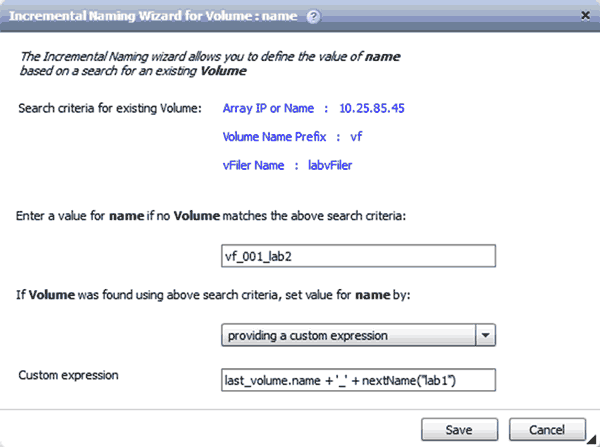

= 増分命名とは何ですか
:allow-uri-read: 
:icons: font
:imagesdir: ../media/

[role="lead"]
増分命名とは、パラメータの検索結果に基づいてワークフロー内の属性に名前を付けるためのアルゴリズムです。属性には、増分値またはカスタム式に基づいて名前を付けることができます。命名機能が強化され、要件に基づいた命名規則を実装できます。

ワークフローを設計する際に増分の命名機能を使用すると、ワークフローで作成されたオブジェクトに動的に名前を付けることができます。この機能を使用すると、リソース選択機能を使用してオブジェクトの検索条件を指定でき、検索条件によって返される値がオブジェクトの属性に使用されます。また、指定された検索条件でオブジェクトが見つからなかった場合は、属性の値を指定できます。

属性に名前を付けるには、次のいずれかのオプションを使用します。

* 増分値とサフィックスを指定します
+
検索条件で検出されたオブジェクトの値とともに使用する値を指定し、指定した数だけ増分することができます。たとえば、命名規則 _filer name_unique number_environment_ でボリュームを作成する場合、 Finder を使用して最後のボリュームを名前のプレフィックスで検索し、一意の番号を 1 ずつ増やすことができます。また、ボリューム名にサフィックス名を追加できます。最後に見つかったボリューム名の接頭辞が _VF_023_prod_で 3 つのボリュームを作成する場合 ' 作成されるボリュームの名前は _VF_024_prod_'_vF_025_prod_'_vF_026_prod_です

* カスタム式を指定する
+
検索条件で検出されたオブジェクトの値とともに使用する値を指定し、入力した式に基づいて値を追加できます。たとえば '_last volume name_environment name の命名規則を持つボリュームを作成する場合 '1_' でパディングすると ''last_volume.name +'_' + nextName("lab1") という式を入力できます見つかった最後のボリューム名が VF_023_ の場合、作成されたボリュームの名前は _VF_023_lab2_ です。

次の図に、命名規則を指定するカスタム式を指定する方法を示します。

